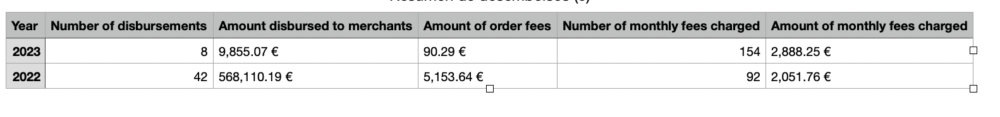

# SeQura Challenge – Disbursement API

A backend system for calculating merchant disbursements, including monthly minimum fees and daily/weekly disbursement rules. Built with Ruby on Rails and PostgreSQL, with Swagger-based API documentation.

## Tech Stack

### Backend
- Ruby on Rails 8
- PostgreSQL
- Sidekiq for background jobs
- RSpec for testing
- FactoryBot for test data generation
- Rswag for Swagger API documentation

## Features

- Calculate disbursements for merchants based on frequency (daily/weekly)
- Enforce minimum monthly fees
- Import merchants and orders from CSV
- Cron-based background jobs with Sidekiq
- Swagger UI for exploring and testing the API

## Setup Instructions

### Option 1: Docker (Recommended)

#### Prerequisites
- Docker
- Docker Compose

#### Steps

1. Clone the repository:
```bash
git clone https://github.com/AlexandreBonfim/sequra_challenge.git
cd sequra_challenge
```

2. Build and start the application:
```bash
docker-compose up --build
```

This will:
- Build the API Docker image
- Set up PostgreSQL and Redis
- Run database migrations
- Start Sidekiq for background jobs
- Serve Swagger documentation

3. Import data (merchants AND orders):
```bash
docker-compose run api rake import:merchants import:orders
```

4. Backfill disbursements and montlhy fees:
```bash
docker-compose run api rake disbursements:backfill monthly_fees:backfill
```

**Access points:**
- API: `http://localhost:3000`
- Swagger Docs: `http://localhost:3000/api-docs`

5. To stop the application:
```bash
docker-compose down
```

### Option 2: Manual Setup

#### Prerequisites
- Ruby 3.2.0 or higher
- PostgreSQL 14 or higher
- Redis
- Node.js 18+ (for assets if needed)

#### Steps

1. Clone the repo and install dependencies:
```bash
git clone https://github.com/AlexandreBonfim/sequra_challenge.git
cd sequra_challenge
bundle install
```

2. Set up the database:
```bash
rails db:create db:migrate
```

3. Import merchants and orders:
```bash
rails import:merchants
rails import:orders
```

4. Backfill disbursements and montlhy fees:
```bash
rails disbursements:backfill
rails monthly_fees:backfill
```

5. Start the Rails server:
```bash
rails server
```

6. Start Sidekiq (optional for background jobs):
```bash
bundle exec sidekiq
```

Visit:
- API at `http://localhost:3000`
- Swagger UI at `http://localhost:3000/api-docs`

## API Documentation

API docs are available at:

```
http://localhost:3000/api-docs
```

## Running Tests

### Backend Specs
```bash
# With Docker
docker-compose run api bundle exec rspec

# Manual
bundle exec rspec
```

## Report Summary


## ⚙️ Technical Decisions and Assumptions
### Choices & Trade-offs
- Rails 8 was used for its rich ecosystem, ease of scaffolding, and mature Active Job support.
- Sidekiq was chosen for background processing of disbursement logic, due to its performance and widespread adoption.
- Swagger via Rswag provides auto-generated docs straight from request specs.
- Postgres UUIDs are used as primary keys to simulate a production-like ID format.

### Assumptions
- Each order belongs to exactly one merchant.
- Disbursements are calculated and created through scheduled background jobs.
- Orders and merchants in the CSV are valid and well-formed (no validation errors).
- No authentication was added, as this is assumed to be a private/internal API.

## 🚀 If I Had More Time
- Add role-based authentication (e.g., Admin vs Merchant views)
- Implement merchant-facing dashboards or endpoints to view disbursement history
- Improve CSV importer to handle updates and detect changes more gracefully
- Add more comprehensive Swagger annotations with descriptions and examples
- Add retry logic and alerting to background job failures
- Logs
- Aplly more clean code and SOLID practices

